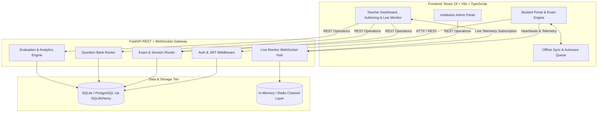

# System Architecture & Technical Specifications — SecureClass

**Status:** Approved  
**Last Updated:** September 2026

---

## 1. High-Level Architecture Diagram

---

## 2. Technology Stack

### Frontend Application
- **Framework:** React 18 with TypeScript (bundled with Vite)
- **Styling & Design System:** TailwindCSS + Custom CSS tokens (warm editorial cream palette `#EFECE4`, slate dark accents, tactile buttons)
- **3D Graphics & Animations:** Three.js for interactive landing page sculptures
- **Routing & State:** `react-router-dom` v6, Context API for authentication and exam session state
- **Network & Realtime:** Axios client with JWT interceptors, Native WebSocket API with automatic exponential reconnect

### Backend Application
- **Framework:** FastAPI (Python 3.10+) asynchronous ASGI framework
- **Server:** Uvicorn ASGI server with hot-reloading support
- **ORM & Database:** SQLAlchemy ORM with declarative models, SQLite for rapid development / PostgreSQL for production
- **Security:** `python-jose` for JWT access/refresh token generation, `passlib` (bcrypt) for password hashing
- **Realtime Infrastructure:** FastAPI WebSocket connection manager with per-exam broadcast rooms

---

## 3. Data Model & Entity Relations

### Core Entities

1. **`User`**: Account entity representing `student`, `teacher`, `admin`, `super_admin`. Links to `Institution` and `student_ref`.
2. **`Classroom` & `ClassroomMember`**: Educational groupings containing teachers and enrolled students.
3. **`Question`**: Versioned question item with Bloom's taxonomy level, subject/topic tags, difficulty rating, options JSON, marks, and distractor misconception mappings.
4. **`Exam`**: Assessment definition containing duration, start/end windows, randomized flag, integrity policies, and blueprint configurations.
5. **`ExamQuestion`**: Many-to-many junction linking questions to exams with custom order and weight override.
6. **`ExamAttempt`**: Student exam session tracking server-calculated start/end times, submission status (`in_progress`, `submitted`, `evaluated`, `terminated`), and final score.
7. **`AttemptAnswer`**: Individual answer submitted per question with response latency and correctness flag.
8. **`IntegrityEvent`**: Audit log recording anomalous student actions (tab blur, fullscreen exit, paste attempt, network reconnection).

---

## 4. Key Subsystems & Communication Protocols

### 4.1 Server-Authoritative Timer & Synchronization
- The client queries the server's time upon initial exam join (`/exams/{id}/join` or `/attempts/{id}`).
- The remaining duration is computed as `exam.duration_minutes * 60 - (current_server_time - attempt.started_at)`.
- Client clock manipulation cannot extend or falsify the attempt duration.

### 4.2 Offline-Resilient Autosave
- When a student selects an option, the answer is saved to client-side storage immediately.
- A background worker fires a background POST request to `/attempts/{id}/answers`.
- If the request fails due to network dropouts, requests are stored in an indexed retry queue and dispatched sequentially as soon as connectivity is restored.

### 4.3 WebSocket Live Proctoring Hub
- **Path:** `/ws/teacher/{exam_id}` (Teacher listener) & `/ws/student/{attempt_id}` (Telemetry emitter).
- Heartbeats are emitted every 5–10 seconds containing current question index, answers saved count, and integrity flags.
- Real-time alerts are pushed immediately to all connected teacher consoles with latency under 150ms.

---

## 5. Security & Threat Model

| Threat Scenario | Mitigation Strategy |
| :--- | :--- |
| **Option order memorization** | Server-side question & option shuffling unique to each student attempt. |
| **Token sharing / Unauthorized join** | Ephemeral access tokens with configurable time-to-live and student USN/email roster validation. |
| **Client-side answer tampering** | Answer keys are never sent to the client during active attempts; scoring is computed entirely server-side. |
| **Browser tab navigation / Cheating** | Fullscreen enforcement, page visibility change listeners, and blur event streaming to teacher dashboard. |
